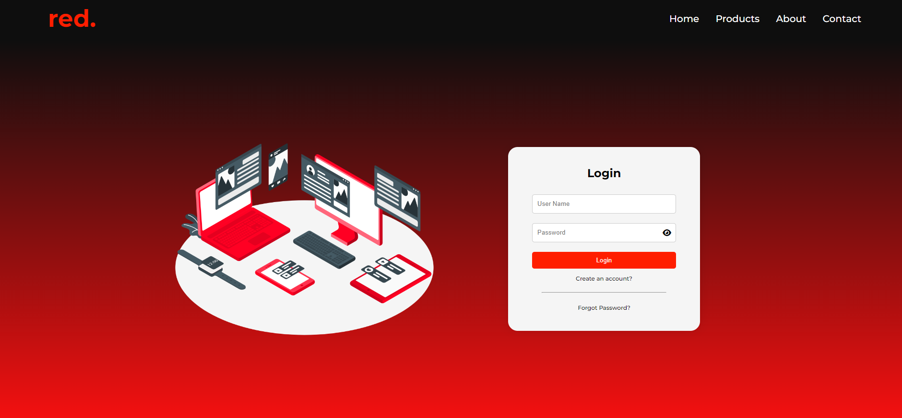

# Red - E-commerce Tech Store

This is a college project for the Web Programming course. The project is a fully functional e-commerce tech store website built using HTML, CSS, JavaScript, and PHP.

## Features

### User Authentication
- **Register:** Users can create a new account using `register.php` and `register-check.php`.
- **Login:** Users can log in to their accounts using `login.php` and `login-check.php`.
- **Logout:** Users can log out of their accounts using `logout.php`.

### Product Management
- **Product Listings:** The website lists various tech products including mobile phones and chargers. 
- **Product Details:** Users can view detailed information about each product, including specifications and prices.

### Sorting and Filtering
- **Sorting:** Users can sort products by price in ascending or descending order using `Sorting.js`.
- **Filtering:** Users can filter search results based on specific criteria (features found in search result files like `M_search_result.php`, `C_search_result.php`, and `H_search_result.php`).

### Shopping Cart
- **Add to Cart:** Users can add products to their shopping cart using `cart.php`.
- **View Cart:** Users can view the contents of their cart, including product details and prices.

### Email Management
- **Email Notifications:** The website includes functionality to handle email notifications using `email.php` and `email-check.php`.

### Database Connection
- **Database Connectivity:** All data interactions are handled via `db_conn.php` for secure and efficient database connectivity.

### Styling
- **Responsive Design:** The website features a responsive design to ensure usability across various devices. Styles are managed using `style.css` and `all.min.css`.

### Miscellaneous
- **Font Awesome Integration:** The project uses Font Awesome for icons, which are included in `all.min.css`.
- **JavaScript Functionality:** Additional JavaScript is used for dynamic content and user interactions.

## Technologies Used

- **HTML**
- **CSS**
- **JavaScript**
- **PHP**

## Getting Started

To run this project locally, follow these steps:

1. **Set up the database and local server:**
   - Create a database and import the provided SQL file to set up the required tables and data.
   - Update `db_conn.php` with your database credentials.
   - Use XAMPP, MAMP, or any local server setup of your choice to serve the PHP files.

2. **Install all the files in the repository:**
   - Ensure all files from the repository are installed in your local server's document root.

## Photos

Here are some screenshots of the website:

*Login Page*

*Home Page*

*Product Listing*

*Product Details*

*Shopping Cart*

## Red Team

- Abdulrhman (Me)
- Ahmed
- Ali
- @Mororock6

## License

This project is licensed under the MIT License - see the [LICENSE](LICENSE) file for details.

## Acknowledgments

- Our college for providing the opportunity to work on this project.
- Our course instructor for the guidance and support.
